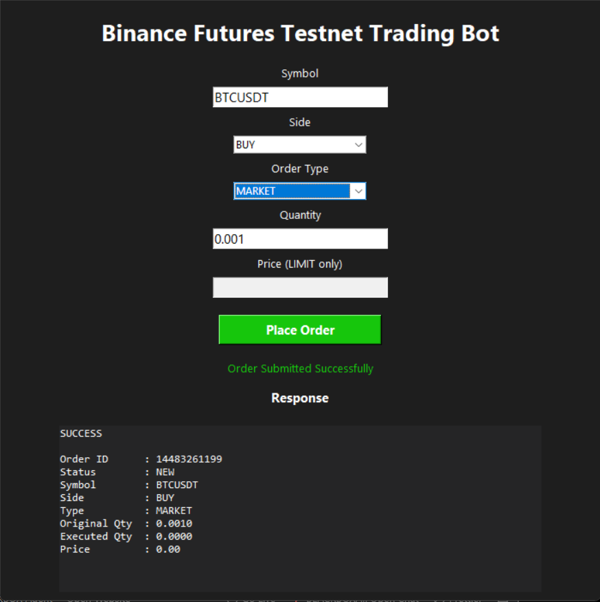
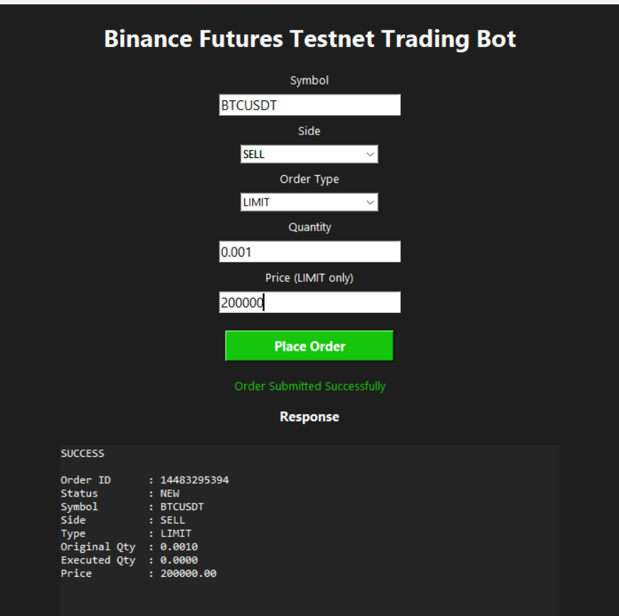

# Binance Futures Testnet Trading Bot

## Overview

A Python-based trading bot that interacts with the Binance Futures Testnet (USDT-M) and allows users to place Market and Limit orders through both a Command Line Interface (CLI) and a lightweight Graphical User Interface (GUI).

The project was developed as part of a Python Developer Internship assignment and demonstrates API integration, input validation, logging, error handling, and modular software design.

---

## Features

### Core Features

* Place **Market Orders**
* Place **Limit Orders**
* Support for **BUY** and **SELL** orders
* Binance Futures Testnet integration
* Command Line Interface (CLI)
* Input validation
* Error handling
* Request and response logging
* Modular project structure

### Bonus Features

* Lightweight Tkinter-based GUI
* Automatic price field enable/disable for Limit orders
* Status notifications
* User-friendly order response display

---

## Project Structure

```text
trading_bot/

│
├── bot/
│   ├── __init__.py
│   ├── client.py
│   ├── orders.py
│   ├── validators.py
│   ├── logging_config.py
│   ├── cli.py
│   └── gui.py
│
├── logs/
│   └── trading.log
│
├── .env
├── requirements.txt
└── README.md
```

---

## Technologies Used

* Python 3.x
* Binance Futures Testnet
* python-binance
* python-dotenv
* Rich
* Tkinter

---

## Installation

### 1. Clone the Repository

```bash
git clone <repository_url>
cd trading_bot
```

### 2. Install Dependencies

```bash
pip install -r requirements.txt
```

### 3. Create Environment Variables

Create a `.env` file in the project root.

```env
BINANCE_API_KEY=your_api_key
BINANCE_API_SECRET=your_api_secret
```

---

## Binance Futures Testnet Setup

1. Create a Binance Futures Testnet account.
2. Generate API credentials.
3. Add the credentials to the `.env` file.
4. Ensure your testnet account has available virtual funds.

Testnet URL:

https://testnet.binancefuture.com

---

# Running the Application

## CLI Mode

### Market Order

```bash
python -m bot.cli --symbol BTCUSDT --side BUY --type MARKET --quantity 0.001
```

### Limit Order

```bash
python -m bot.cli --symbol BTCUSDT --side SELL --type LIMIT --quantity 0.001 --price 200000
```

---

## GUI Mode

Launch the graphical interface:

```bash
python -m bot.gui
```

The GUI allows users to:

* Enter trading symbol
* Select BUY or SELL
* Select MARKET or LIMIT order
* Enter quantity
* Enter price for LIMIT orders
* Submit orders
* View order responses

---

## Input Validation

The application validates:

* Supported order side (BUY / SELL)
* Supported order type (MARKET / LIMIT)
* Positive quantity values
* Price requirement for LIMIT orders

Invalid inputs generate descriptive error messages.

---

## Logging

All API requests, responses, and errors are logged to:

```text
logs/trading.log
```

Example:

```text
2026-06-08 12:24:41 - INFO - MARKET order | BTCUSDT | BUY | qty=0.001
2026-06-08 12:24:42 - INFO - Response | orderId=14482168364 status=NEW
```

---

## Error Handling

The application handles:

* Invalid user input
* Binance API exceptions
* Network failures
* Missing parameters
* Authentication issues

---

## Sample Output

```text
SUCCESS

Order ID      : 14482714137
Status        : NEW
Symbol        : BTCUSDT
Side          : SELL
Type          : LIMIT
Original Qty  : 0.0010
Executed Qty  : 0.0000
Price         : 200000.00
```

---

## Assumptions

* Users possess valid Binance Futures Testnet API credentials.
* Orders are executed on Binance Futures Testnet only.
* Internet connectivity is available during execution.
* Market conditions may affect order execution status.

---

## Author

Developed as part of a Python Developer Internship Assignment demonstrating API integration, software structure, validation, logging, and user interface design.

## Screenshots

### Main Interface


### Market Order Execution



### Limit Order Execution

